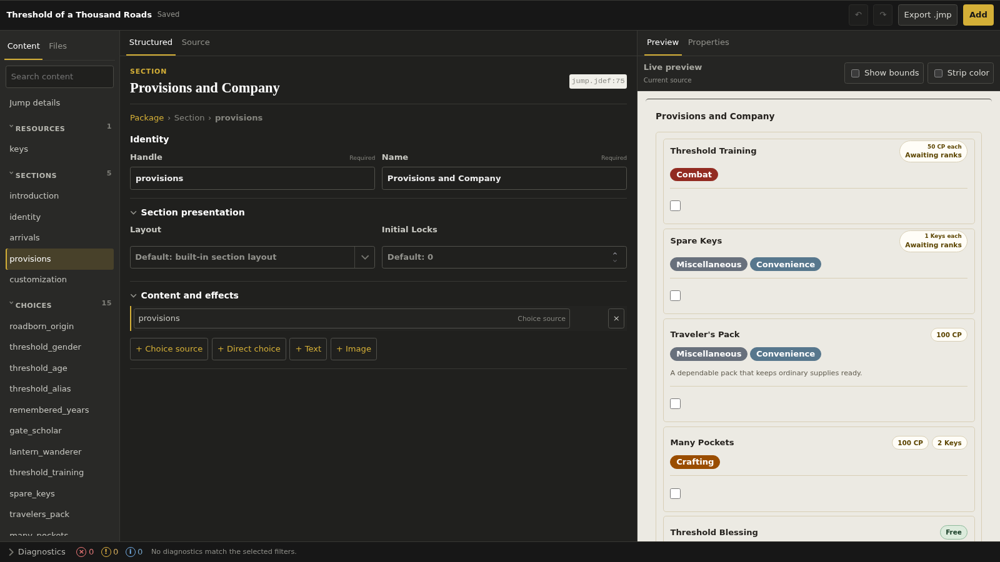
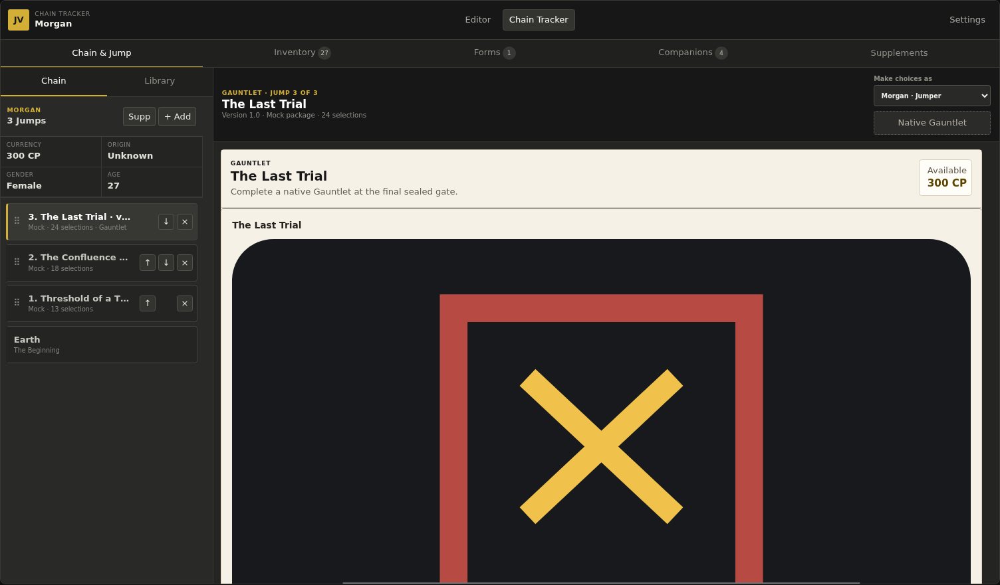
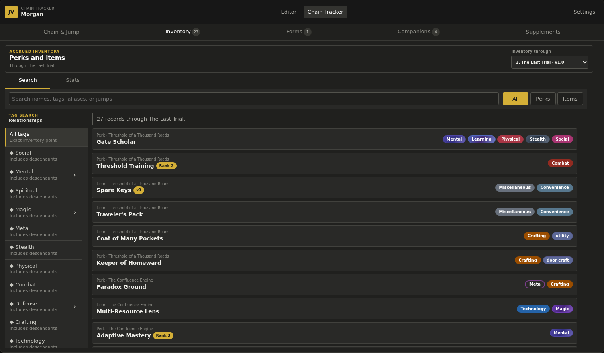
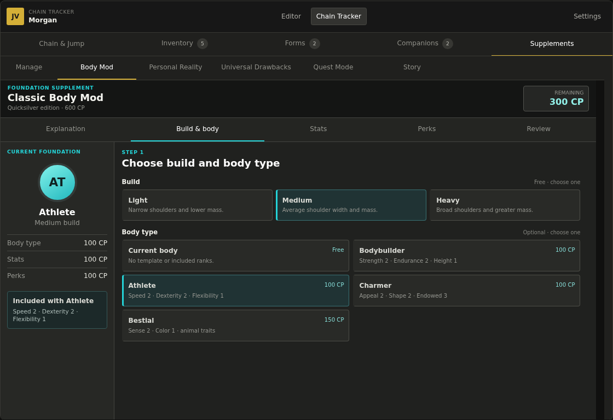

# Jumpchain Visualizer

<!-- PROJECT PREAMBLE: START -->

So this project has been a long time coming. I first started trying to make a jumpchain visualizer back in 2017, I didn't know any web stack stuff back then so I opted to try making it in WPF. I made some progress, but the complexity of the application and the mounting trials of my career killed my motivation to spend my nights grinding away.

Moreover, the product I was creating was, frankly put, not half the quality of what this has turned out to be. Yea, this is AI slop, but every time it tries something clever I realize it's something a jumpchain visualizer needs. When I returned to the project back in 2025 when Codex CLI released I didn't know what to expect. I knew react by then, but the motivation still wasn't there and a mountain loomed before me. Suprisingly, it created something functional. Until this point my experience with AI slop was just that, it was slop. But when I saw how far it had come from the half-functional github copilot I knew this would be how jumpchain visualizer is made.

Despite randomly creating the tag badges that are now ubiquitous across my attempts at a jumpchain visualizer GPT still wasn't quite good enough to create something I was satisfied with though, and so the project was shelved. Later it was unshelved when GPT 5 launched, then shelved again, and unshelved with 5.4, and shelved again until the release of 5.6 This was it, a model that could go all the way while requiring nothing but my input.

Gone were the days of looking at the models code and trying to fix the myriad regressions it introduced with each change. Of course, while 5.6 Sol is an incredible model in terms of capability, my understanding of AI and the way I used it had changed as well. And, while it's still evolving, I was finally able to get something I felt was worth releasing.

But what is this and why did I have GPT make it? This is not something I expect to be used heavily, nor is it something I expect to be supported long into the future. Rather, the entire project was meant to show the world that we can have something better. Jumpchains are at their core a game of imagination, no different than the CYOAs they were built on. But the bookkeeping was insane. I recall downloading the word document with the categories for the different perk types in different colors from jumpchain general and being excited to collect perks across my jumps... That is, until I had to actually start pasting things from the PDFs.

That's where this idea came from. Jumpchains without the work. My only hope is that someone uses this and can't go back to doing it by hand. Not because I want people to be impressed with what's been made, but because it means one more person may put the work in that I'm not willing to and makes something at least as good. Anyway, thanks for reading, the rest of this was done by the bot, I may rewrite it myself eventually.

<!-- PROJECT PREAMBLE: END -->

Jumpchain Visualizer is an offline-first editor and chain tracker for creating, inspecting, playing, and managing Jumpchain packages. The packaged Tauri desktop application is the primary target; the same React application also runs in a browser for development and testing.

## Feature showcase

### Build complete Jump packages

Author with structured forms or edit Format 1 source directly. Both views share live validation, contextual diagnostics, project assets, undo/redo, and a rendered preview, then export the result as a `.jmp` package.



### Play and track a whole chain

Import Jump packages, arrange a chain, make choices for the Jumper or companions, and follow each Jump's resources and selections without losing the wider journey.



### Search everything acquired along the way

Inspect inventory at any point in the chain, search by name or source Jump, separate perks from items, and filter with hierarchical Tags whose presentation belongs to the user's active Tag profile.



### Keep supplements in the same workspace

Eight built-in supplement modules cover Body Mod alternatives, persistent spaces, Universal Drawbacks, Quest Mode, Story, and Limited Inheritance while sharing state with the active chain. Limited Inheritance can restrict future Inventory, Forms, and Companion profiles to configurable per-Jump pools without hiding acquisitions in their source Jump.



## More highlights

- Local-first operation with no account, hosted backend, paid service, or telemetry dependency.
- Secure package inspection before import, including archive, image, source, schema, reference, and size validation.
- Accrued forms and companion rosters alongside perks and items.
- Light and dark themes, keyboard-accessible interactions, and interfaces in English, Italian, Brazilian Portuguese, European Spanish, and Latin American Spanish.
- One Format 1 renderer shared by Editor previews and the Chain Tracker.

## Run from source

### Prerequisites

- Node.js 24.18 or newer within the Node 24 LTS line. [`.node-version`](.node-version) is authoritative.
- Corepack and pnpm 11.11.0.
- For the desktop application, Rust and the [Tauri 2 system prerequisites](https://v2.tauri.app/start/prerequisites/) for your platform.

Install dependencies and start the browser development server:

```sh
corepack pnpm install
corepack pnpm dev
```

Vite serves the application at `http://127.0.0.1:1420`.

To run it in the desktop shell instead:

```sh
corepack pnpm tauri dev
```

## Verification

The everyday local gate formats, lints, type-checks, tests, builds the client, checks Rust, and runs the Chromium smoke journeys:

```sh
corepack pnpm check
```

Broader browser and release gates are documented in the [verification playbook](documentation/development/verification-performance.html).

## Documentation

- [Documentation library](documentation/index.html)
- [Format 1 author reference](documentation/guides/format-1-reference.html)
- [Format 1 language specification](documentation/development/markup.html)
- [Application architecture](documentation/development/architecture.html)
- [Linux release playbook](documentation/development/linux-release.html)

## License

Jumpchain Visualizer is released into the public domain under [The Unlicense](UNLICENSE). Dependency notices are collected in [THIRD_PARTY_NOTICES.txt](THIRD_PARTY_NOTICES.txt).
